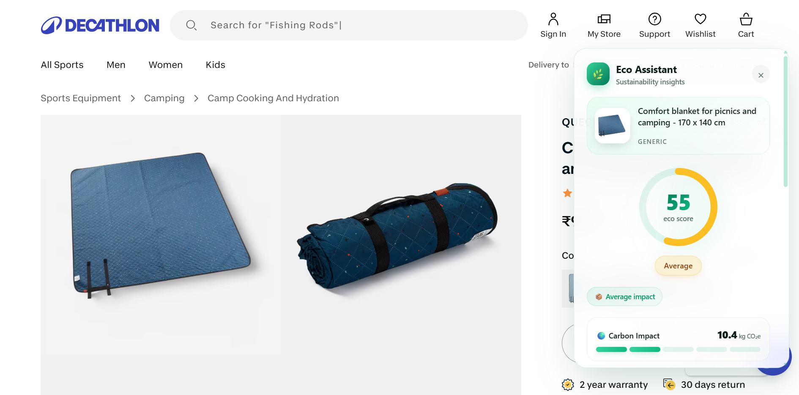

# 🌿 Eco Shopping Assistant

A Chrome extension + Node.js backend that detects products on shopping sites
(Amazon, Flipkart, Myntra) and shows a real-time sustainability score, eco
insights, and greener alternatives — directly inside the page via a beautiful
floating glassmorphism panel.



---

## ✨ Features

- 🔍 **Smart product detection** on Amazon, Flipkart, Myntra
- ♻️ **Sustainability score (0–100)** with rule-based engine
- 📊 **Animated score ring**, eco rating badges, and tips
- 🌱 **Greener alternatives** suggested per category
- 🪟 **Floating glassmorphic panel** injected into the page
- 🌗 **Dark / light mode** toggle in the popup
- 🕒 **History, streaks & weekly summary** in `chrome.storage`
- 🌍 **Carbon footprint estimate** per product
- 🛡️ Works offline with a built-in local fallback scorer

---

## 🧱 Project Structure

```
eco-shopping-assistant/
├── extension/
│   ├── manifest.json          # MV3 manifest
│   ├── popup/                 # Popup UI (HTML/CSS/JS)
│   ├── content/               # Content script — DOM scraping + panel
│   ├── background/            # Service worker
│   ├── styles/                # Panel styles (glassmorphism)
│   ├── utils/                 # Scraper helpers
│   └── assets/                # Icons
│
├── backend/
│   ├── server.js              # Express bootstrap
│   ├── routes/                # /analyze-product, /suggest-alternatives
│   ├── controllers/           # Request orchestration
│   ├── services/              # Scoring + alternatives engines
│   ├── utils/                 # Keywords + text generation
│   ├── middleware/            # Error handler
│   ├── models/                # Optional Mongoose scaffold
│   ├── config/                # Config (port, db URI)
│   └── package.json
│
├── docs/
└── README.md
```

---

## 🚀 Installation

### 1. Backend

```bash
cd backend
npm install
npm start
# 🌿 Eco backend running on http://localhost:5050
```

### 2. Chrome Extension

1. Open `chrome://extensions` in any Chromium browser.
2. Enable **Developer mode** (top-right toggle).
3. Click **Load unpacked** → select the `extension/` folder.
4. Visit a product page on Amazon / Flipkart / Myntra.
5. The 🌿 floating panel appears on the right with a sustainability score.

> Prefer a single download? Get the packaged `eco-shopping-assistant.zip`
> from the landing page included in this repo.

---

## 📡 API

### `GET /health`
Health check. Returns `{ status: "ok" }`.

### `POST /analyze-product`
Body:
```json
{ "title": "...", "description": "...", "price": "...", "category": "...", "url": "..." }
```
Returns:
```json
{
  "score": 72,
  "rating": "Good",
  "matched": [{ "keyword": "organic", "weight": 25 }],
  "explanation": "Positive signals: organic. ...",
  "tips": ["..."],
  "carbonEstimateKg": 8.36,
  "alternatives": [{ "name": "...", "reason": "..." }]
}
```

### `POST /suggest-alternatives`
Returns 3 greener alternatives based on detected category.

---

## 🧠 Scoring Engine

Rule-based keyword scoring on title + description + category. Examples:

| Keyword          | Weight |
|------------------|--------|
| Organic          | +25    |
| Bamboo           | +30    |
| Recycled         | +20    |
| Plastic          | -20    |
| Fast fashion     | -25    |
| Excess packaging | -15    |

Final score buckets: **0–30 Poor · 31–60 Average · 61–80 Good · 81–100 Excellent**.

See `backend/utils/keywords.js`.

---

## 🏗️ Architecture

```
 ┌──────────────┐  scrape   ┌─────────────────┐  POST /analyze-product
 │ Content      │──────────▶│  Express API    │
 │ Script (MV3) │           │  scoring +      │
 └──────────────┘◀──────────│  alternatives   │
        │  render            └─────────────────┘
        ▼
 ┌──────────────┐
 │ Floating     │  ◀── chrome.storage history / streak
 │ Eco Panel    │
 └──────────────┘
```

---

## 🔮 Future Improvements

- Real LCA (Life-Cycle Assessment) data sources
- LLM-powered eco explanations
- Brand sustainability database
- Price-vs-impact comparison
- Carbon offset checkout integration
- Firefox + Edge MV3 builds

---

Made with 🌱 by the Eco Assistant team.
